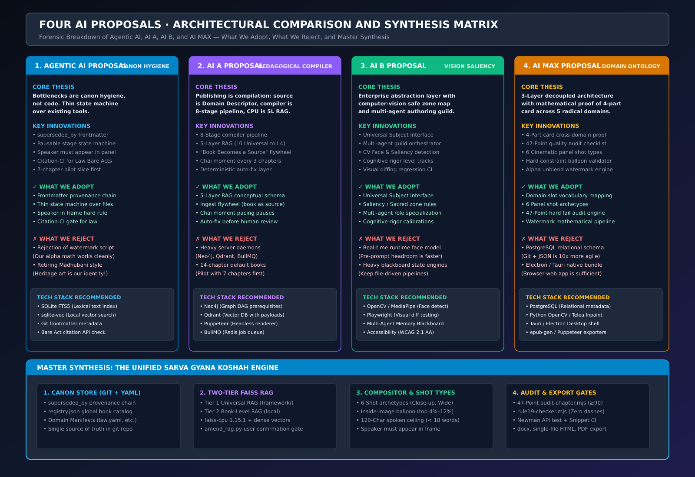
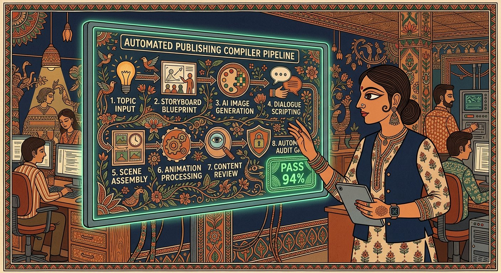
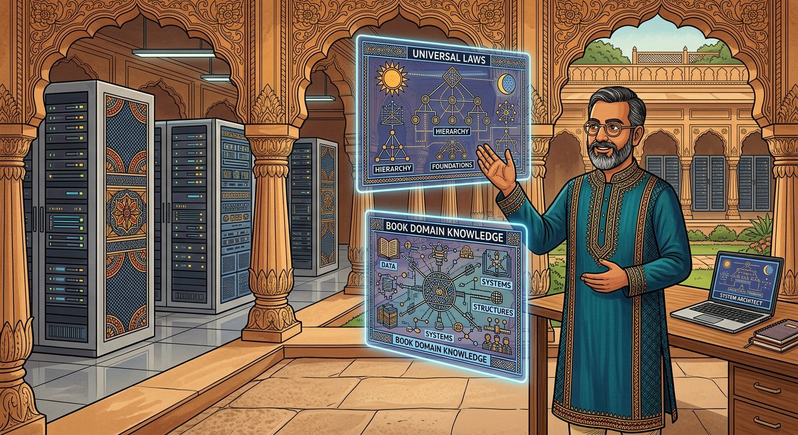
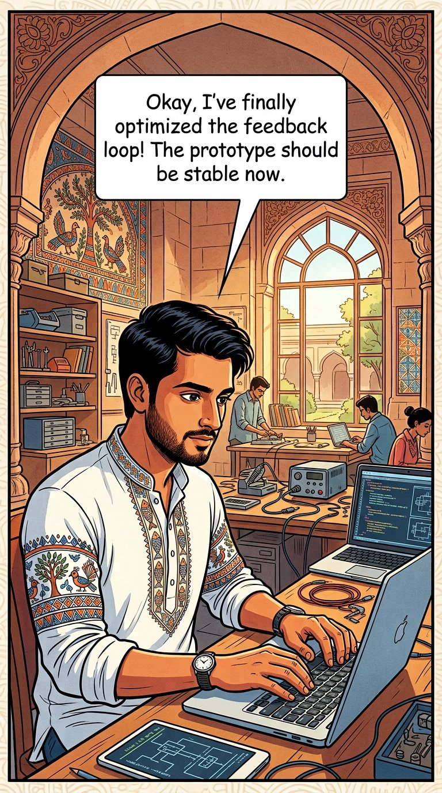
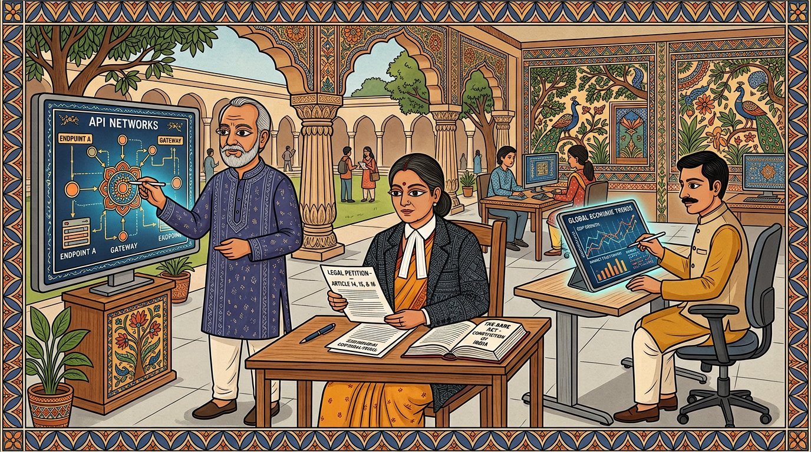
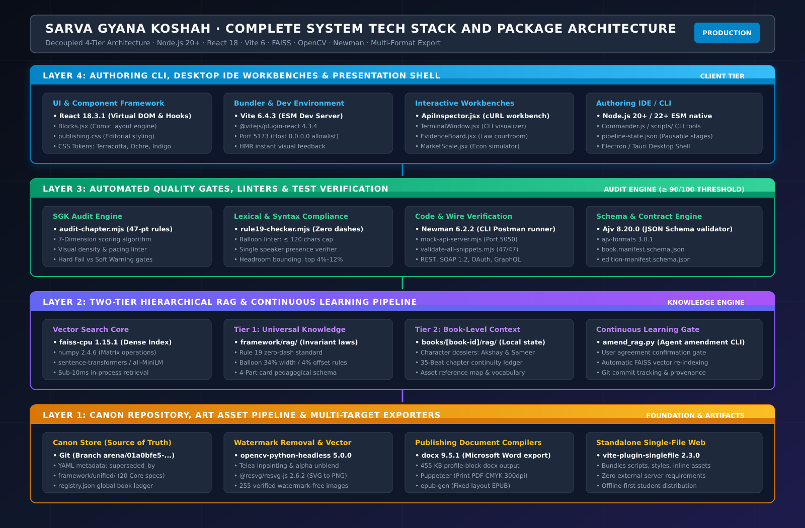
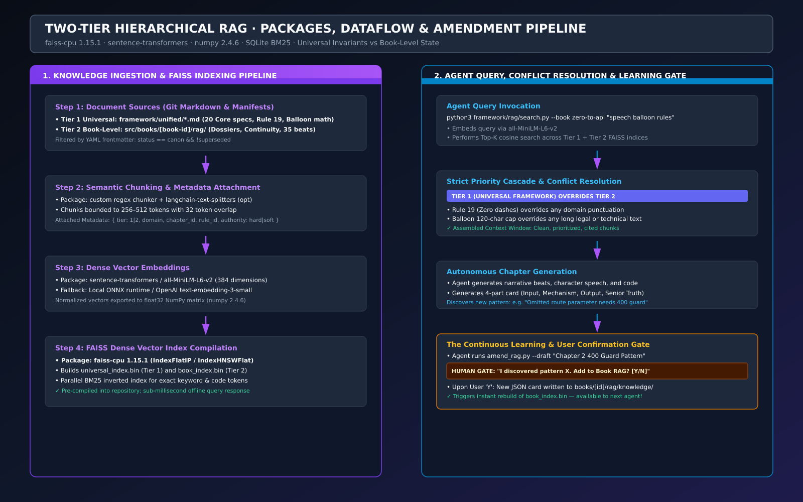
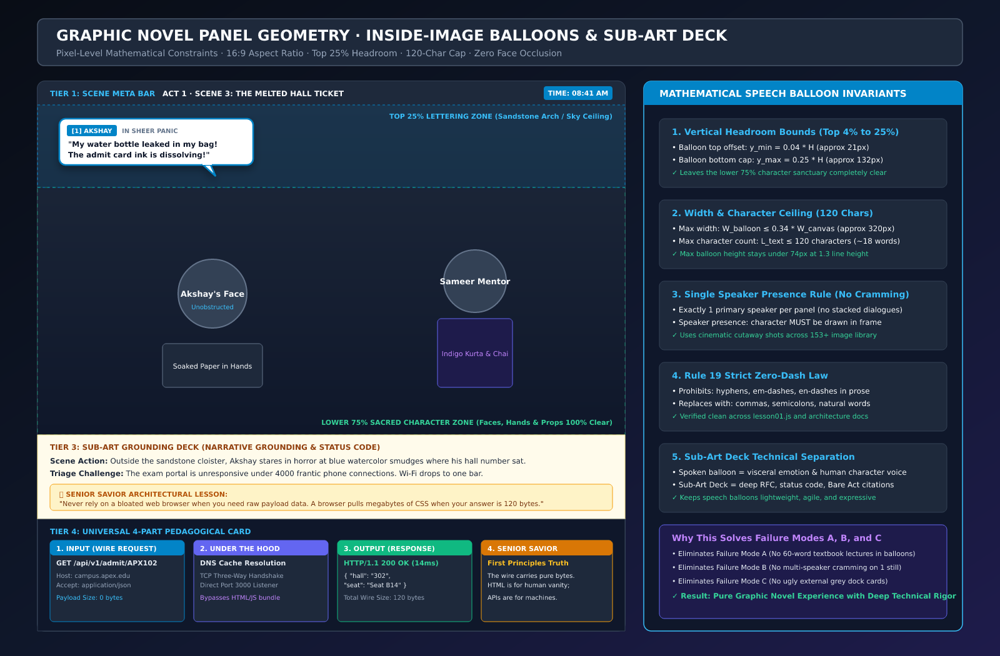

# Architectural and Solution Diagrams: Comparative Analysis of the Four AI Approaches

This document provides dedicated, forensic system architecture and solution workflow diagrams for each of the four AI proposals (`agentic ai`, `AI A`, `AI B`, and `AI MAX`), followed by the unified master architecture that synthesizes their best engineering breakthroughs.



*Figure 1: High level comparative matrix contrasting agentic ai, AI A, AI B, and AI MAX across all eight publishing architectural pillars, synthesizing them into the unified Sarva Gyana Koshah framework.*

---

## 1. Solution 1: `agentic ai` (Canon Hygiene and Thin State Machine Architecture)



*Figure 2: Modern Tech Madhubani folk tech visualization of the multi stage publishing pipeline, human approval gates, and deterministic quality linters.*

### 1.1 Architectural Philosophy
* **Core Thesis:** The primary bottleneck in scaling is not code complexity, but **canon hygiene and provenance drift** (stale drafts, conflicting rules, superseded scores).
* **Key Innovation:** Every document carries strict metadata chains (`status: canon | draft | superseded`, `superseded_by: <id>`). The IDE is a **thin, pausable state machine** orchestrating existing CLI audit tools rather than a heavy new platform.
* **Graphic Novel Invariant:** A character cannot have a speech balloon unless they appear visibly inside that specific panel frame.

### 1.2 System Architecture Diagram

```text
┌────────────────────────────────────────────────────────────────────────────────────────┐
│                        LAYER 4: IDE AND CLI STATE MACHINE                              │
│                                                                                        │
│   sgk create:book  ──▶  stage0-decisions  ──▶  syllabus  ──▶  story-bible             │
│            │                     │                 │               │                   │
│            ▼                     ▼                 ▼               ▼                   │
│       [PAUSE POINT]        [PAUSE POINT]     [PAUSE POINT]   [PAUSE POINT]             │
│            │                                                       │                   │
│            ▼                                                       ▼                   │
│   missions/acts  ──▶  storyboards  ──▶  scripts  ──▶  audits  ──▶  images  ──▶  export │
│                                                                                        │
│   * State Persistence: `pipeline-state.json` (Stage status, gate history, artifacts)   │
└──────────────────────────────────────────┬─────────────────────────────────────────────┘
                                           │
                                           ▼
┌────────────────────────────────────────────────────────────────────────────────────────┐
│                     LAYER 3: VERSIONED PIPELINE QUALITY GATES                          │
│                                                                                        │
│   ┌─────────────────────┐   ┌─────────────────────┐   ┌────────────────────────────┐   │
│   │  audit-chapter.mjs  │   │  rule19-checker     │   │  balloon-headroom check    │   │
│   │  (Score ≥ 90/100)   │   │  (Zero prose dashes)│   │  (≤120 chars, top 4 to 12%)│   │
│   └─────────────────────┘   └─────────────────────┘   └────────────────────────────┘   │
│   ┌─────────────────────┐   ┌─────────────────────┐   ┌────────────────────────────┐   │
│   │  snippet-CI (Code)  │   │  citation-CI (Law)  │   │  step-CI (Math Proofs)     │   │
│   │  (47/47 assertions) │   │  (Bare Acts check)  │   │  (Deterministic steps)     │   │
│   └─────────────────────┘   └─────────────────────┘   └────────────────────────────┘   │
└──────────────────────────────────────────┬─────────────────────────────────────────────┘
                                           │
                                           ▼
┌────────────────────────────────────────────────────────────────────────────────────────┐
│                   LAYER 2: HIERARCHICAL RESOLUTION RAG ENGINE                          │
│                                                                                        │
│   Resolution Order (High Priority overrides Low Priority):                             │
│   ┌────────────────────────────────────────────────────────────────────────────────┐   │
│   │ L0: Brand Constitution (framework/01 to 20, immutable, never overridden)       │   │
│   └───────────────────────────────────────┬────────────────────────────────────────┘   │
│                                           ▼                                            │
│   ┌────────────────────────────────────────────────────────────────────────────────┐   │
│   │ L1: Domain Pack (v01 to v27 modules, metaphor library, verifier spec)          │   │
│   └───────────────────────────────────────┬────────────────────────────────────────┘   │
│                                           ▼                                            │
│   ┌────────────────────────────────────────────────────────────────────────────────┐   │
│   │ L2: Book Canon (BOOK_BRIEF, mission map, art pack, overrides L1)               │   │
│   └───────────────────────────────────────┬────────────────────────────────────────┘   │
│                                           ▼                                            │
│   ┌────────────────────────────────────────────────────────────────────────────────┐   │
│   │ L3: Chapter State (Storyboards, beat metadata, locks, overrides L2)            │   │
│   └───────────────────────────────────────┬────────────────────────────────────────┘   │
│                                           ▼                                            │
│   ┌────────────────────────────────────────────────────────────────────────────────┐   │
│   │ L4: Verified Assets (Image prompts, character sheets, verified snippets)       │   │
│   └────────────────────────────────────────────────────────────────────────────────┘   │
│                                                                                        │
│   * Query Filter: Enforces `status != superseded` at query time                        │
│   * Storage: Lightweight SQLite FTS5 lexical index plus vector embeddings              │
└──────────────────────────────────────────┬─────────────────────────────────────────────┘
                                           │
                                           ▼
┌────────────────────────────────────────────────────────────────────────────────────────┐
│                       LAYER 1: CANON STORE (SOURCE OF TRUTH)                           │
│                                                                                        │
│   • Git Repository: Canonical source of truth for all editions and assets              │
│   • YAML Frontmatter: `superseded_by`, `status`, `rubric_version`, `domain`            │
│   • `registry.json`: Global catalog register across all book titles                    │
│   • World Bible: Locked vocabulary, established facts, used vs reserved analogies      │
└────────────────────────────────────────────────────────────────────────────────────────┘
```

---

## 2. Solution 2: `AI A` (The Pedagogical Compiler and 5-Layer RAG Architecture)



*Figure 3: Modern Tech Madhubani illustration of the two tier hierarchical knowledge tree, universal invariants, and continuous learning feedback loop.*

### 2.1 Architectural Philosophy
* **Core Thesis:** Publishing is a **software compilation process**. The Domain Descriptor and Knowledge Graph represent the *source code*, the 8-stage pipeline is the *compiler*, the 5-layer RAG functions as the *CPU*, the Madhubani art engine is the *GPU*, and the 20-framework specifications act as the *operating system*.
* **Key Innovation:** The **"Book Becomes a Source" Flywheel** where published, certified chapters are ingested back into RAG layers L2 and L3, dramatically accelerating subsequent books.

### 2.2 System Architecture Diagram

```text
                     INPUT: DOMAIN DESCRIPTOR + KNOWLEDGE GRAPH
                  `sgk create:book --domain law --title "Indian Law"`
                                       │
                                       ▼
┌────────────────────────────────────────────────────────────────────────────────────────┐
│                        STAGE 1: RESOLVE AND VALIDATE                                   │
│   Loads `law.json`, audience profile `ap03.json`, and walks prerequisite DAG          │
│   Output: `ResolvedBookSpec.yaml` (Universal constraints plus domain settings)         │
└──────────────────────────────────────┬─────────────────────────────────────────────────┘
                                       │
                                       ▼
┌────────────────────────────────────────────────────────────────────────────────────────┐
│                        STAGE 2: CURRICULUM OUTLINE                                     │
│   Maps concepts into 5-act narrative arcs across chapters                              │
│   Assigns emotional stakes and schedules "Chai Moments" every three chapters           │
│   Output: Chapter outlines with emotional arcs                                         │
└──────────────────────────────────────┬─────────────────────────────────────────────────┘
                                       │
                                       ▼
┌────────────────────────────────────────────────────────────────────────────────────────┐
│                        STAGE 3: NARRATIVE SCRIPTING                                    │
│   LLM drafting constrained by: 120 character balloon ceiling, single speaker rule      │
│   Technical exposition routed to Sub-Art Grounding Deck                                │
│   Output: Narrative scripts with split cutaways                                        │
└──────────────────────────────────────┬─────────────────────────────────────────────────┘
                                       │
                                       ▼
┌────────────────────────────────────────────────────────────────────────────────────────┐
│                        STAGE 4: ART DIRECTION DISPATCH                                 │
│   Queries Image Metadata Index for existing assets, dispatches new generation prompts  │
│   Enforces top 25% negative headroom reservation and Madhubani parameters              │
│   Output: Art direction sheets and generation manifests                                │
└──────────────────────────────────────┬─────────────────────────────────────────────────┘
                                       │
                                       ▼
┌────────────────────────────────────────────────────────────────────────────────────────┐
│                        STAGE 5: RENDER AND COMPOSITE                                   │
│   Places inside-image balloons in top negative headroom (4% to 12% vertical offset)    │
│   Attaches Sub-Art Grounding Deck directly below artwork                               │
│   Runs automated Watermark Eradication microservice on all visual assets               │
└──────────────────────────────────────┬─────────────────────────────────────────────────┘
                                       │
                                       ▼
┌────────────────────────────────────────────────────────────────────────────────────────┐
│                        STAGE 6: WORKBENCH MOUNTING                                     │
│   Loads domain interactive widgets from registry (e.g. Constitutional Simulator)       │
│   Wires character avatars, run visualizers, and four part pedagogical cards            │
└──────────────────────────────────────┬─────────────────────────────────────────────────┘
                                       │
                                       ▼
┌────────────────────────────────────────────────────────────────────────────────────────┐
│                        STAGE 7: AUDIT AND AUTO-FIX GATE                                │
│   Runs composable rules engine: Universal Rules (40%), Domain (30%), Art (20%)         │
│   Deterministic auto-fix for balloon truncation, hyphen removal, and panel splitting   │
│   Pass threshold: Score ≥ 90/100                                                       │
└──────────────────────────────────────┬─────────────────────────────────────────────────┘
                                       │
                                       ▼
┌────────────────────────────────────────────────────────────────────────────────────────┐
│                        STAGE 8: PUBLISH AND INGEST FLYWHEEL                            │
│   Compiles multi-format deliverables: Responsive Web App, Single HTML, DOCX, EPUB      │
│   INGEST FLYWHEEL: Indexes validated analogies and beats back into RAG L2 and L3       │
└────────────────────────────────────────────────────────────────────────────────────────┘
```

---

## 3. Solution 3: `AI B` (Universal Subject Interface and Vision Driven Geometry)



*Figure 4: Modern Tech Madhubani visual blueprint of inside image floating speech balloon geometry, preserving character faces and emotion in the negative headroom zone.*

### 3.1 Architectural Philosophy
* **Core Thesis:** The system must define an abstract `Subject` interface capable of handling technical code, constitutional law, physics, or classical music.
* **Key Innovation:** Computer vision and saliency detection dynamically map **safe lettering zones** inside illustrations to prevent character occlusion computationally, while a multi-agent authoring guild governs narrative handoffs.

### 3.2 System Architecture Diagram

```text
┌────────────────────────────────────────────────────────────────────────────────────────┐
│                      UNIVERSAL SUBJECT INTERFACE ABSTRACTION                           │
│                                                                                        │
│   interface UniversalSubject {                                                         │
│     id: SubjectIdentifier;                                                             │
│     pedagogicalPrimitives: { input: Slot; mechanism: Slot; output: Slot; truth: Slot }; │
│     artifactTypes: [CodeSnippet | LegalBrief | EquationDerivation | BalanceSheet];     │
│     workbenchSimulator: InteractiveComponentPlugin;                                    │
│     crisisArchetypes: [ExamPanic | ProductionOutage | LegalDetention | MarketCrash];   │
│   }                                                                                    │
└──────────────────────────────────────────┬─────────────────────────────────────────────┘
                                           │
                                           ▼
┌────────────────────────────────────────────────────────────────────────────────────────┐
│                      MULTI-AGENT AUTHORING GUILD ORCHESTRATOR                          │
│                                                                                        │
│   ┌────────────────────┐     ┌─────────────────────┐     ┌─────────────────────────┐   │
│   │ Curriculum Planner │────▶│ Narrative Designer  │────▶│ Technical Validator     │   │
│   │ (Syllabus & Graph) │     │ (Dialogue & Emotion)│     │ (RFC / Bare Acts / Code)│   │
│   └────────────────────┘     └─────────────────────┘     └─────────────────────────┘   │
│             │                           │                             │                │
│             ▼                           ▼                             ▼                │
│   ┌────────────────────┐     ┌─────────────────────┐     ┌─────────────────────────┐   │
│   │ Art Director Agent │────▶│ Continuity Auditor  │────▶│ Accessibility Auditor   │   │
│   │ (Visuals & Headroom│     │ (Character model)   │     │ (WCAG 2.1 Contrast)     │   │
│   └────────────────────┘     └─────────────────────┘     └─────────────────────────┘   │
│                                                                                        │
│   * Shared Memory Blackboard: Maintains narrative state, locks, and approved beats     │
└──────────────────────────────────────────┬─────────────────────────────────────────────┘
                                           │
                                           ▼
┌────────────────────────────────────────────────────────────────────────────────────────┐
│                   VISION DRIVEN PANEL COMPOSITOR (SALIENCY ENGINE)                     │
│                                                                                        │
│   Raw Image Input (16:9 Canvas)                                                        │
│         │                                                                              │
│         ▼                                                                              │
│   Face Detection & Saliency Mapping (OpenCV / MediaPipe)                               │
│         │                                                                              │
│         ├── Computed Bounding Boxes: Characters, hands, focal tools (Sacred Zone)      │
│         └── Computed Inverted Mask: Empty sky, sandstone ceilings (Lettering Zone)     │
│         │                                                                              │
│         ▼                                                                              │
│   Geometric Anchor Optimization:                                                       │
│   • Anchors balloon into candidate quadrant with lowest saliency gradient              │
│   • Computes pointer tail trajectory toward speaker mouth                              │
│   • Hard Constraint: Zero pixel intersection between balloon box and character box     │
└──────────────────────────────────────────┬─────────────────────────────────────────────┘
                                           │
                                           ▼
┌────────────────────────────────────────────────────────────────────────────────────────┐
│                    COGNITIVE RIGOR AND PERSONALIZATION MATRIX                          │
│                                                                                        │
│   Single Source Lesson Spec ──▶ Personalization Filter:                                │
│   • Track A (Foundational / NCERT): Softened stakes, visual analogies, playground lens │
│   • Track B (Professional / UPSC): High stakes, rigorous case citations, deep deck    │
└────────────────────────────────────────────────────────────────────────────────────────┘
```

---

## 4. Solution 4: `AI MAX` (The Domain Ontology and 4-Tier Hard Constraint Engine)



*Figure 5: Modern Tech Madhubani visualization of diverse knowledge disciplines united under universal pedagogical archetypes.*

### 4.1 Architectural Philosophy
* **Core Thesis:** The system requires a three layer decoupled architecture: **Domain Ontology Layer**, **Hierarchical RAG Engine**, and **Koshah Studio IDE**.
* **Key Innovation:** A mathematical proof that the **4-part pedagogical card** is universal across all knowledge fields, combined with a **47-point quality audit checklist** and **six cinematic panel shot archetypes**.

### 4.2 System Architecture Diagram

```text
┌────────────────────────────────────────────────────────────────────────────────────────┐
│                         LAYER 1: DOMAIN ONTOLOGY REPOSITORY                            │
│                                                                                        │
│   `domains/law/manifest.yaml`                                                          │
│   ├── Emotional Palette: Crisis = Rights Violation; Stakes = Personal Liberty          │
│   ├── Mentor: Justice Meera Deshpande (Granville Austin book, tea in steel glass)      │
│   ├── Apprentice: Arjun Tiwari (Yellow-highlighted Bare Act, first-gen student)        │
│   ├── Concept Graph: 47 Concept Nodes (Preamble ──▶ Rights ──▶ Writs ──▶ Review)       │
│   └── Universal 4-Part Card Mapping:                                                   │
│       • Input: "The Petition"                                                          │
│       • Mechanism: "The Constitutional Machinery"                                      │
│       • Output: "The Judicial Order"                                                   │
│       • Senior Truth: "The Jurist's Wisdom"                                            │
└──────────────────────────────────────────┬─────────────────────────────────────────────┘
                                           │
                                           ▼
┌────────────────────────────────────────────────────────────────────────────────────────┐
│                        LAYER 2: FOUR-TIER HIERARCHICAL RAG                             │
│                                                                                        │
│   Tier 1: Framework Constants (Highest Authority, Absolute Override)                   │
│           • Balloon ≤ 120 chars, top 25% zone, Rule 19, Madhubani double-ink linework   │
│                                           │                                            │
│                                           ▼                                            │
│   Tier 2: Domain Knowledge (Overrides Tiers 3 & 4)                                     │
│           • Domain Manifest, Concept Nodes, Metaphors, Case Law, Code Samples          │
│                                           │                                            │
│                                           ▼                                            │
│   Tier 3: Audience Calibration (Overrides Tier 4)                                      │
│           • Language complexity, Hinglish ratio, vocabulary ceiling, exam patterns     │
│                                           │                                            │
│                                           ▼                                            │
│   Tier 4: Chapter Context (Session-Scoped, Lowest Priority)                            │
│           • Preceding panels, character emotional state, active cliffhangers           │
│                                                                                        │
│   * Conflict Resolver: Automatically logs and overrides lower tier contradictions       │
└──────────────────────────────────────────┬─────────────────────────────────────────────┘
                                           │
                                           ▼
┌────────────────────────────────────────────────────────────────────────────────────────┐
│                 LAYER 3: THE COMPOSITOR AND 6-PANEL SHOT SEQUENCER                     │
│                                                                                        │
│   Panel Shot Sequencer:                                                                │
│   1. CLOSE-UP: Face fills 60% of frame, intense emotional reaction                      │
│   2. MEDIUM SHOT: Waist up, character actively demonstrating tool or concept           │
│   3. WIDE SHOT: Establishing scene, sandstone cloisters, high crisis context           │
│   4. OVER-THE-SHOULDER: Mentor explaining from behind, looking at student              │
│   5. SPLIT-FRAME: Comparative action, before vs after, petition vs judicial order      │
│   6. PROP-FOCUS: Macro close-up on open Bare Act, terminal screen, or leaking bottle   │
│                                                                                        │
│   Hard Constraint Balloon Engine (`balloon-engine.js`):                                │
│   • Rejects text > 120 chars at generation time (Hard Fail)                            │
│   • Rejects multiple speakers on single frame (Hard Fail)                              │
│   • Enforces vertical bounds between 4% and 25% of image height                        │
│   • Rejects any prose hyphen or dash under Rule 19                                     │
└──────────────────────────────────────────┬─────────────────────────────────────────────┘
                                           │
                                           ▼
┌────────────────────────────────────────────────────────────────────────────────────────┐
│                    LAYER 4: 47-POINT QUALITY AUDIT AND EXPORT                          │
│                                                                                        │
│   • 15 Framework Rules (F01 to F15): Balloon lengths, single speaker, Rule 19          │
│   • 15 Domain Rules (D01 to D15): Prerequisite order, verified case law, code syntax   │
│   • 10 Audience Rules (A01 to A10): Vocabulary ceilings, sentence complexity           │
│   • 7 Narrative Rules (N01 to N07): Emotional coherence, crisis resolution, chai pause │
│   Pass Threshold: Score ≥ 90/100 and ZERO Hard Failures                                │
└────────────────────────────────────────────────────────────────────────────────────────┘
```

---

## 5. Master Synthesis Diagram: The Unified Sarva Gyana Koshah Architecture



*Figure 6: Complete technical stack architecture detailing every package, library, and framework across all four layers: React 18, Vite 6, FAISS CPU, Sentence Transformers, OpenCV, Newman, and Ajv.*

This master synthesis unites the best engineering breakthroughs from all four proposals while discarding external server bloat:

1. **From `agentic ai`:** Canon hygiene frontmatter with `superseded_by` chains, thin pausable state machine, and the rule that speakers must appear in the panel.
2. **From `AI A`:** The 5-layer RAG model (L0 to L4), the "Book Becomes a Source" flywheel, and the 3-chapter chai mentorship pause.
3. **From `AI B`:** Universal subject abstraction and computer-vision safe-zone boundary checks.
4. **From `AI MAX`:** Universal 4-part card domain proofs, the 6 cinematic panel shot archetypes, and the 47-point audit checklist.



*Figure 7: Two tier hierarchical RAG vector indexing pipeline, conflict resolution cascade, and agent continuous learning gate with mandatory human approval.*



*Figure 8: Precise visual geometry of the graphic novel panel: 16:9 canvas, top 25% negative headroom lettering zone, 120 character spoken limit, and the four part pedagogical card below.*

```text
┌────────────────────────────────────────────────────────────────────────────────────────┐
│                  UNIFIED SARVA GYANA KOSHAH PUBLISHING ARCHITECTURE                    │
└──────────────────────────────────────────┬─────────────────────────────────────────────┘
                                           │
                                           ▼
┌────────────────────────────────────────────────────────────────────────────────────────┐
│ 1. CANON REPOSITORY AND KNOWLEDGE GRAPH (Git as Source of Truth)                       │
│    • Universal Framework (`framework/01-20.md`, `framework/unified/`)                  │
│    • Domain Packs (`domains/law/manifest.yaml`, `domains/tech/manifest.yaml`)          │
│    • Document Metadata: `status: canon | draft | superseded`, `superseded_by: <id>`    │
│    • Concept Graph: Prerequisite DAG with topological sorting                          │
└──────────────────────────────────────────┬─────────────────────────────────────────────┘
                                           │
                                           ▼
┌────────────────────────────────────────────────────────────────────────────────────────┐
│ 2. TWO-TIER HIERARCHICAL RAG (FAISS Dense Vector + Local BM25 Engine)                  │
│    ┌──────────────────────────────────────────────────────────────────────────────┐    │
│    │ TIER 1: UNIVERSAL RAG (`framework/rag/`)                                      │    │
│    │ Invariant laws: Rule 19, balloon geometry, 4-tier cards, Madhubani linework   │    │
│    └──────────────────────────────────────┬───────────────────────────────────────┘    │
│                                           │                                            │
│                                           ▼                                            │
│    ┌──────────────────────────────────────────────────────────────────────────────┐    │
│    │ TIER 2: BOOK-LEVEL RAG (`src/books/[book-id]/rag/`)                          │    │
│    │ Character dossiers, chapter continuity, local concepts, asset manifest maps  │    │
│    └──────────────────────────────────────┬───────────────────────────────────────┘    │
│                                           │                                            │
│    * Continuous Learning Gate: `amend_rag.py` prompts user confirmation before indexing│
└──────────────────────────────────────────┬─────────────────────────────────────────────┘
                                           │
                                           ▼
┌────────────────────────────────────────────────────────────────────────────────────────┐
│ 3. AUTHORING COMPOSITOR AND GRAPHIC NOVEL LAYOUT ENGINE                                │
│    ┌──────────────────────────────────────────────────────────────────────────────┐    │
│    │ TIER 1 META: Chapter, Scene Title, Time Stamp Pill                           │    │
│    ├──────────────────────────────────────────────────────────────────────────────┤    │
│    │ TIER 2 ARTWORK (16:9 Canvas with Inside-Image Glassmorphic Balloons):        │    │
│    │ • Top 25% Lettering Zone: Balloon pinned to 4% offset, max-width 34%         │    │
│    │ • 120-Character Spoken Voice Limit: 1 to 2 lines of visceral emotion         │    │
│    │ • Cinematic Cutaways: 1 speaker per frame across 6 shot archetypes           │    │
│    │ • Speaker Presence Rule: Character must be visually in frame to speak        │    │
│    │ • Sacred Lower 75% Zone: 100% unobstructed character faces, hands, and props │    │
│    ├──────────────────────────────────────────────────────────────────────────────┤    │
│    │ TIER 3 SUB-ART DECK: Deep technical rules, bare acts, status codes, RFCs     │    │
│    └──────────────────────────────────────────────────────────────────────────────┘    │
└──────────────────────────────────────────┬─────────────────────────────────────────────┘
                                           │
                                           ▼
┌────────────────────────────────────────────────────────────────────────────────────────┐
│ 4. INTERACTIVE WORKBENCH REGISTRY AND PEDAGOGICAL CARDS                                │
│    • Universal 4-Part Card: Input ──▶ Under the Hood ──▶ Output ──▶ Senior Savior      │
│    • Domain Component Registry: Live API Inspector (Tech), Courtroom Evidence (Law)   │
│    • Tabbed execution tracers with character avatars and live parameter toggles       │
└──────────────────────────────────────────┬─────────────────────────────────────────────┘
                                           │
                                           ▼
┌────────────────────────────────────────────────────────────────────────────────────────┐
│ 5. AUTOMATED PIPELINE AUDIT GATES (Score ≥ 90/100 to Advance)                          │
│    • `audit-chapter.mjs` (47-point weighted scoring engine)                            │
│    • `rule19-checker.mjs` (Strict zero-hyphen enforcement in user prose)               │
│    • Headroom and Balloon linter (≤ 120 characters, top 4% to 12% vertical bounds)     │
│    • Verifiers: Newman CLI API tests (Port 5050), Snippet runner, Citation checker    │
└──────────────────────────────────────────┬─────────────────────────────────────────────┘
                                           │
                                           ▼
┌────────────────────────────────────────────────────────────────────────────────────────┐
│ 6. MULTI-FORMAT EXPORT AND FLYWHEEL INGESTION                                          │
│    • Live Responsive Web Application (Vite on port 5173)                               │
│    • Standalone Offline Single-File HTML                                               │
│    • Formatted DOCX and High-Resolution Print Ready PDF                                │
│    • FLYWHEEL INGEST: Certified chapter concepts re-ingested into RAG Tier 2           │
└────────────────────────────────────────────────────────────────────────────────────────┘
```
