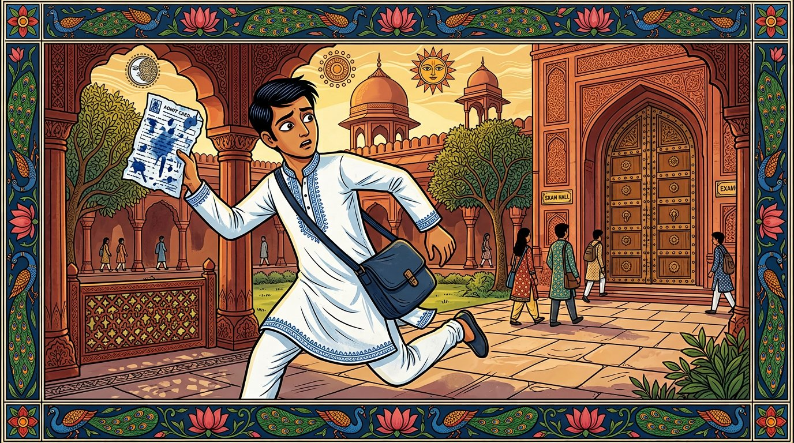

# Chapter 01: Image Generation Directive & Production Tracker

> **Notice for Image AI:** 
> Read the complete instructions in this document and generate the 7 scene illustrations according to the specifications in [`03-IMAGE_AI_PROMPTS.md`](file:///c:/Users/AkshatSinha/Documents/avd/AkshatEbooks/src/books/technical/programming/testing/zero-to-agentic-api-testing/pipeline/ch01/03-IMAGE_AI_PROMPTS.md).
> As you generate and save each image, update the checklist table below. The Architect/Editorial AI will review the output images, inspect composition, framing, and SVG overlay compatibility, and provide feedback directly in the Review column.

---

## 📍 File Locations Reference

| Role | File Path |
|------|-----------|
| **Detailed Prompts & Master Style Guide** | [`pipeline/ch01/03-IMAGE_AI_PROMPTS.md`](file:///c:/Users/AkshatSinha/Documents/avd/AkshatEbooks/src/books/technical/programming/testing/zero-to-agentic-api-testing/pipeline/ch01/03-IMAGE_AI_PROMPTS.md) |
| **Complete Story Dialogue & Scenes** | [`pipeline/ch01/02-STORY_AI_SCRIPT.md`](file:///c:/Users/AkshatSinha/Documents/avd/AkshatEbooks/src/books/technical/programming/testing/zero-to-agentic-api-testing/pipeline/ch01/02-STORY_AI_SCRIPT.md) |
| **Output Image Storage Directory** | `src/books/technical/programming/testing/zero-to-agentic-api-testing/pipeline/ch01/resources/` (and mirrored to `assets/illustrations/`) |
| **Status, Review & Feedback Tracking** | *This file* (`pipeline/ch01/03-IMAGE_AI_TRACKER.md`) |

---

## 🎨 Mandatory Technical & Aesthetic Rules for Image AI

1. **Aspect Ratio:** `16:9` widescreen format (`1408x768` or `1365x768`).
2. **Art Style:** Authentic Madhubani (Mithila) folk art graphic novel style with bold double-line black ink contours, sharp almond-shaped (*badam*) eyes, and rich flat gouache color fills.
3. **Heritage + Future Theme:** Majestic Indian red sandstone arches and courtyards (Fatehpur Sikri inspired) fused with subtle high-tech elements (whisper-thin cyan optical fiber lines embedded in stone grooves, matte-black diagnostic slates, discreet edge-server nodes).
4. **Border Frame:** Every panel MUST be framed by an intricate traditional Madhubani peacock and lotus ornamental border along all 4 outer edges.
5. **CRITICAL TEXT INVARIANT:** **Do NOT generate any English letters, words, dialogue, code, or fake IDE windows inside the pixels of the image.** 
   - All dialogue speech bubbles, code windows, and terminal lines are rendered dynamically via crisp SVG overlays.
   - If your model accidentally renders pseudo-English gibberish, re-roll with negative prompt: `text, typography, watermark, signature, letters, code, numbers`.
6. **Negative Prompt to Include:**
   ```text
   text, watermark, logo, typography, blurry, low resolution, photorealistic, 3d render, western comic style, deformed hands, extra fingers, english letters, bad anatomy
   ```

---

## 💬 SVG Dialogue Overlay Protocol

### Does the System Know How to Put SVG Text Above the Image?
**Yes, completely.** The web rendering engine uses a layered responsive vector container:
```html
<div class="comic-card-container" style="position: relative; width: 100%; aspect-ratio: 16 / 9;">
  <!-- Base Generated Image -->
  
  
  <!-- Dynamic SVG Overlay Layer -->
  <svg viewBox="0 0 1408 768" style="position: absolute; inset: 0; width: 100%; height: 100%; pointer-events: none;">
    <!-- Vector Speech Bubbles & Badges are rendered crisply here -->
  </svg>
</div>
```

### Request to Image AI
- Ensure the top 20% to 25% of each panel has adequate breathing room (sky, arch ceilings, or soft background foliage) where the SVG speech bubbles can sit comfortably without obscuring character faces.
- If you have suggestions or prefer custom SVG bubble placement for your generated composition, note the optimal `x`, `y` coordinates in your response!

---

## 📋 Production Image Checklist & Review Table

> **How to Use:**
> 1. When an image is generated, change **Status** from `Pending` to `Generated`.
> 2. Fill in the **Image File Location**.
> 3. The Reviewer AI will inspect the image, update **Review Status** (`Approved` or `Needs Revision`), and write constructive feedback in **Editorial Comments & Required Changes**.

| Scene # | Scene Title | Asset Filename | Status | Review Status | Image File Location | Editorial Comments & Required Changes |
| :---: | :--- | :--- | :---: | :---: | :--- | :--- |
| **01** | The Ink Dissolves on the Quad | `ch01-scene-01-ink-dissolves.jpg` | `Pending` | `Not Reviewed` | `pipeline/ch01/resources/ch01-scene-01-ink-dissolves.jpg` | *(Awaiting generation)* |
| **02** | The White Screen Portal Spinner | `ch01-scene-02-portal-spinner.jpg` | `Pending` | `Not Reviewed` | `pipeline/ch01/resources/ch01-scene-02-portal-spinner.jpg` | *(Awaiting generation)* |
| **03** | The 14 Millisecond Terminal Rescue | `ch01-scene-03-terminal-rescue.jpg` | `Pending` | `Not Reviewed` | `pipeline/ch01/resources/ch01-scene-03-terminal-rescue.jpg` | *(Awaiting generation)* |
| **04** | The Whiteboard Restaurant Model | `ch01-scene-04-canteen-waiter.jpg` | `Pending` | `Not Reviewed` | `pipeline/ch01/resources/ch01-scene-04-canteen-waiter.jpg` | *(Awaiting generation)* |
| **05** | Pair Programming: Port 3000 & Byte Stream | `ch01-scene-05-byte-stream-trap.jpg` | `Pending` | `Not Reviewed` | `pipeline/ch01/resources/ch01-scene-05-byte-stream-trap.jpg` | *(Awaiting generation)* |
| **06A** | The Five CRUD Verbs & Brass Thali Rule | `ch01-scene-06a-brass-thali.jpg` | `Pending` | `Not Reviewed` | `pipeline/ch01/resources/ch01-scene-06a-brass-thali.jpg` | *(Awaiting generation)* |
| **06B** | The Three Paradigms: REST, SOAP, GraphQL | `ch01-scene-06b-three-paradigms.jpg` | `Pending` | `Not Reviewed` | `pipeline/ch01/resources/ch01-scene-06b-three-paradigms.jpg` | *(Awaiting generation)* |

---

## 🚀 Exact Prompt to Pass to Your Image AI

You can directly copy and paste the prompt block below to your Image AI:

```markdown
Hello Image AI! We are building Chapter 01 of "Zero to Agentic API Testing".
Please review:
1. `src/books/technical/programming/testing/zero-to-agentic-api-testing/pipeline/ch01/03-IMAGE_AI_PROMPTS.md` for the exact image generation prompts, character style bible, and SVG speech bubble coordinates for all 7 scenes.
2. `src/books/technical/programming/testing/zero-to-agentic-api-testing/pipeline/ch01/03-IMAGE_AI_TRACKER.md` for the production checklist.

Your tasks:
1. Generate the 7 illustrations in 16:9 widescreen format following the Madhubani Mithila + Solarpunk Indian tech aesthetic.
2. Ensure absolutely NO text, code, or english letters are generated inside the images (SVG speech bubbles will be layered dynamically on top).
3. Save the 7 images in `pipeline/ch01/resources/`.
4. Update the checklist table in `pipeline/ch01/03-IMAGE_AI_TRACKER.md` setting Status to "Generated".
5. Note any custom SVG overlay suggestions in the tracker file.

Once done, notify the Architect AI who will review every image and provide feedback or approval!
```
